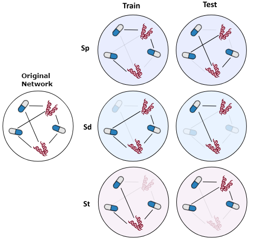
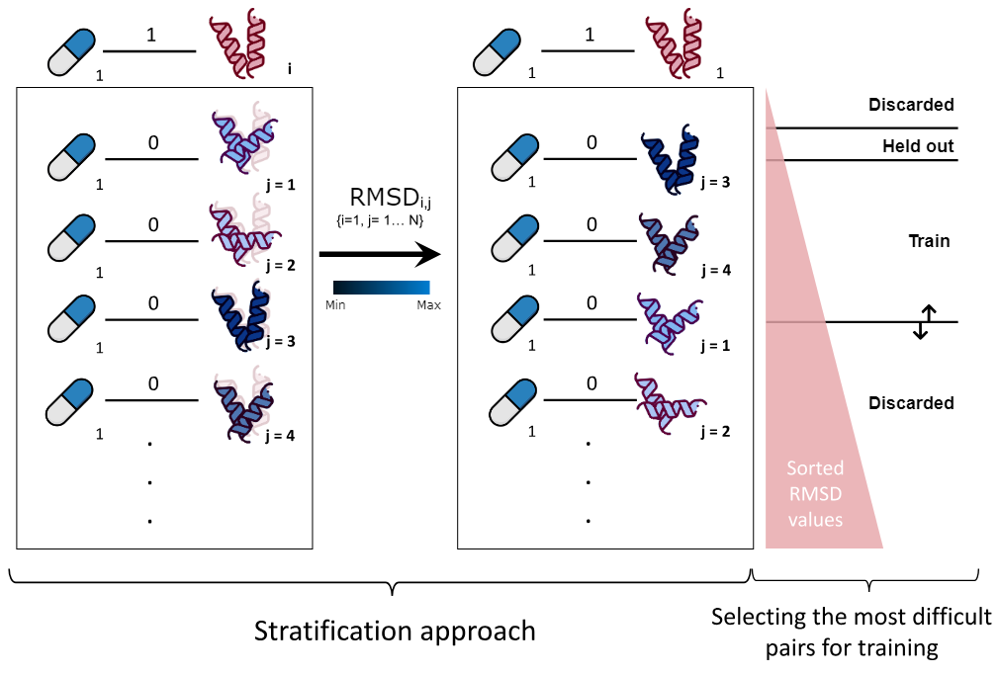

# Graph Universal Embedding Splitting Tool (GUEST)

## Description

This is a package for evaluating Graph Embedding prediction methodologies. GraphGuest works on any kind of heterogeneous undirected graphs with exact 2 types of nodes and 1 type of edge. It was developed in the context of drug repurposing, as a part of the paper "Towards a more inductive world for drug repurposing approaches". From now on, we will refer to the nodes type 1 and 2 as Drugs and Proteins, respectively, hence the evaluated graph would be a Drug Target Interaction (DTI) network.

### GraphGuest splitting functionality

GraphGuest allows to split any chosen network into train/test following several criteria: 
- **Random**: There is no constraint imposed, DTIs are distributed across train and test randomly.
- **Sp**: Related to pairs. Any drug or protein may appear both in the train and test set, but interactions cannot be duplicated in the two sets.
- **Sd**: Related to drug nodes. Drug nodes are not duplicated in the train and test set, i.e., a node evaluated during training does not appear in the test set. 
- **St**: Related to targets. Protein nodes are not duplicated in the train and test set, each protein seen during training does not appear in the test set. 

    

### GraphGuest subsampling functionality

Generally DTI networks are highly sparse, i.e., there is a high number of negative interactions compared to the positive ones. Hence, including all negative edges is not feasible, 
and would bias the model towards negative predictions. Accordingly, usually a balanced dataset is built by selecting all the positive interactions 
and subsampling the same number (negative to positive ratio of 1) of negatives randomly. In the presented work, we showed that random subsampling can oversimplify the 
prediction task, as it is likely that the model is not evaluated on hard-to-classify negative samples. Also, this subsampling methodology lacks of biological meaning.
Hence, we proposed to weight negative interactions based on a structural-based metric (RMSD of the distance between atoms of two protein structures) to find hard-to-classify
samples and increase accuracy and robustness of the drug repurposing model.

In this line, GraphGuest allows to use a matrix of distances/scores between every Protein as an alternative to random subsampling. If this matrix is provided, for each positive DTI,
the negative DTI will be formed by the same drug and the protein that better maximizes (or minimizes) the distance/score with respect to the original protein from the positive DTI.

    

## How to use it

Here now we describe the functionalities and parameters of the GraphGuest GUEST class:
- **DTIs**: Interaction list in the form of a pandas matrix with the columns "Drug" and "Protein" as the type 1 and 2 nodes.
- **mode**: The already introduced split criteria: random, Sp, Sd or St (default: Sp).
- **subsampling**: Whether all interactions are chosen to build the dataset or subsampling is preferred instead (default: True).
- **n_seeds**: Number of times the dataset will be built, varying the seed, hence yielding different splits (default: 5).
- **negative_to_positive_ratio**: How many negatives DTI will be subsampled respect to the positives ones  (default: 1).

First, load the required libraries:

    from graphguest import GUEST
    import pandas as pd

Then, load the DTI dataset. It must be a pandas matrix containing the columns "Drug" and "Protein". An example of the Yamanishi's NR network is located in the test folder (nr_dti.txt).

    DTIs = pd.read_csv("tests/nr_dti.txt", sep='\t', header=None) 
    DTIs.columns = ['Drug', 'Protein']

Load the GUEST object, specifying the mode you want the dataset to fulfill, subsampling options, number of seeds, number of folds, etc. See help for more information.

    ggnr = GUEST(DTIs, mode = "Sp", subsampling = True, n_seeds = 5)

Optionally, you can pass as an argument any score matrix related to the Protein's column. In this case, we will pass the matrix formed by computing
the RMSD between every pair of proteins in the NR dataset we are working with. Consequently, now the negative subsampling will be replaced by a 
rank-based subsampling, in which for every DTI, the rank will be used to select the negatives DTIs according to a predefined threshold (See RMSD Figure).

    #Apply rank based on RMSD, in this case the discarded RMSD are <=2.5, the left 
    #out are >2.5 & <=5 and we will use RMSD values >5 & <=6 to subsample negatives.
    ggnr.apply_rank(RMSD_threshold = (2.5,5,6), fpath = 'tests/rmsd_nr.pkl')

Now, generate the splits according to the specified options. Here, two different functions can be called:

    #Generate splits 
    ggnr.generate_splits_cv(foldnum=10) #(Cross-Validation)
    ggnr.generate_splits_tvt() #(Train-Validation-Test)

Finally, retrieve the results. If RMSD option has been applied, a extra dictionary (prot_info_dict) with info will be returned.

    #Retrieve results
    seed_cv_list  = ggnr.retrieve_results() #(Default)
    seed_cv_list, prot_info_dict = ggnr.retrieve_results() #(RMSD applied)

You can verify that your splits fulfill the mode requirements after they have been generated. Note that
if any rank matrix is applied instead of random subsampling, split constraints will not be applied due to 
inconsistencies between the rank and the split constraints.

    #Test your splits
    ggnr.test_splits() 
    
    #verbose can be set to True if more information is desired. (verbose's default: False)
    ggnr.test_splits(verbose=True) 

    #You can also visualize the final distribution of DTIs by setting distr to True (distr's default: False)
    ggnr.test_splits(distr=True)
    
